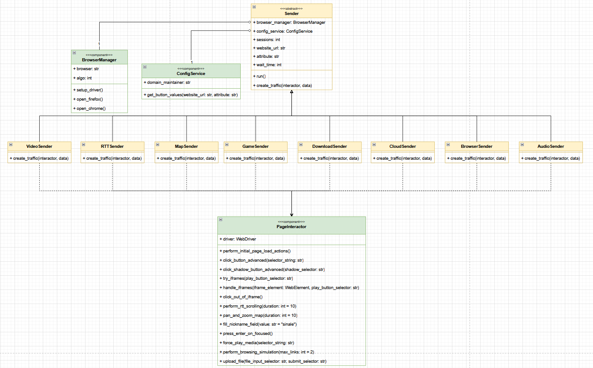

# **Automated Web Traffic Generation Service**

## **1\. Project Overview**

This service is a Python-based application designed to generate realistic, automated web traffic for a wide range of websites. It is built to run inside a Docker container and is controlled via a simple Flask API.  
The primary goal is to simulate human-like interactions for various categories of websites (e.g., Video, Game, Download, Map) to test network performance or other system behaviors.  
The application receives a POST request specifying the target URL, browser, and traffic category. It then launches a headless, automated browser instance (using Selenium) and performs a sequence of actions (like clicking buttons, scrolling, and playing media) to generate authentic traffic patterns.

## **2\. Core Architecture**

The codebase is structured around the **Single Responsibility Principle (SRP)** and utilizes a **Composition over Inheritance** model to ensure maximum maintainability and extensibility.  
The "brain" of the operation is broken into specialized components:

* **Orchestrator (Sender):** A central class that manages the overall job, such as looping through sessions and coordinating the other components.  
* **Specialists (Components):** A set of classes that are "experts" at one specific task (e.g., one class *only* knows how to launch browsers, another *only* knows how to click buttons).  
* **Strategies (Child Senders):** Simple, thin classes that define the *sequence* of actions for a specific traffic type (e.g., the VideoSender strategy tells the system to "click shadow button, then click play button, then wait").

This architecture makes the system robust. If a button-clicking-logic bug is found, it only needs to be fixed in one place (the PageInteractor), and all 8 traffic types are instantly corrected.

## **3\. Component Breakdown**

Here is an explanation of each major file and its role in the system.

### **entry.py (API Entry Point)**

This is the main entry point for the Docker container. It runs a Flask web server with three primary functions:

* /health: A simple health check endpoint to confirm the service is running.  
* /: Serves a static HTML page (e.g., kyber\_page.html), which likely acts as the user-facing control panel.  
* /execute: The main API endpoint. It receives a JSON POST request with job details (browser, algorithm, sessions, domain, attribute). It is responsible for:  
  1. Validating the incoming request.  
  2. Instantiating the correct "Strategy" class (e.g., VideoSender) based on the attribute field.  
  3. Calling the .run() method on that sender instance to start the traffic generation job.

### **sender\_base.py (The Orchestrator)**

This file contains the abstract base class Sender.

* **Sender(ABC)**: This is the core "Orchestrator" class that all specific senders (like VideoSender) inherit from. It is **not** responsible for *how* to do things, but rather *when* to do them. Its jobs are:  
  1. **Composition:** It creates and holds instances of the BrowserManager and ConfigService.  
  2. **Configuration:** Its \_\_init\_\_ method intelligently determines the correct wait\_time by checking for passed arguments, attribute-specific environment variables (e.g., VIDEO\_WAIT\_TIME), and a DEFAULT\_WAIT\_TIME.  
  3. **Execution:** The run() method contains the main logic loop. It runs for the specified number of sessions and, for each session, it:  
     * Fetches the button configuration from the ConfigService.  
     * Delegates browser creation to the BrowserManager.  
     * Creates a PageInteractor for the new driver.  
     * Calls the abstract create\_traffic() method, which is implemented by the child class.  
     * Handles all driver cleanup.

### **browser\_manager.py (The Browser Specialist)**

This class has one responsibility: **managing the browser's lifecycle.**

* **BrowserManager**: This class contains all the complex logic for launching and configuring a Selenium WebDriver.  
  * setup\_driver(): The main method, which returns a ready-to-use driver.  
  * open\_chrome() / open\_firefox(): These methods contain the platform-specific configurations, including:  
    * Setting PQC (Post-Quantum Cryptography) algorithm flags (algo).  
    * Configuring headless mode and anti-detection flags (like \--disable-blink-features=AutomationControlled).  
    * Spoofing geolocation.

### **page\_interactor.py (The Action Specialist)**

This class has one responsibility: **performing actions on a webpage.** It is a "toolkit" of interaction methods.

* **PageInteractor**: This class is initialized with an active driver and provides all the methods for "human-like" interaction. Its key methods include:  
  * click\_button\_advanced(): A powerful method that can find and click buttons using multiple strategies:  
    * Comma-separated values (for sequential clicks).  
    * Pipe-separated values (for fallback selectors).  
    * class\[index\] syntax (to click the Nth element).  
    * :text syntax (to find a button by its visible text).  
  * click\_shadow\_button\_advanced(): Finds and clicks elements inside a Shadow DOM.  
  * try\_iframes(): Searches for and interacts with elements inside \<iframe\> tags.  
  * force\_play\_media(): A robust method to find \<video\> or \<audio\> tags and force them to play using JavaScript.  
  * fill\_nickname\_field(): Finds form fields with common "name" keywords.  
  * perform\_browsing\_simulation(): Simulates scrolling and clicking internal links.  
  * upload\_file(): Simulates a file upload by creating a dummy file and sending its path to an \<input type="file"\> element.  
  * pan\_and\_zoom\_map(): Simulates dragging and scrolling on a map.

### **config\_service.py (The Data Specialist)**

This class has one responsibility: **fetching external configuration.**

* **ConfigService**:  
  * Its \_\_init\_\_ method reads the CONFIG\_SERVICE\_URL from an environment variable.  
  * Its get\_button\_values() method calls the external domain\_maintainer API. It uses tldextract to find the base domain (e.g., youtube.com) and requests the button selectors for a given attribute.  
  * It uses the backoff library to automatically retry API calls if the service is temporarily unavailable, making the system more resilient.

### **Attribute Senders (e.g., video\_sender.py, game\_sender.py, etc.)**

These files define the **Strategies**. Each class inherits from Sender and is very simple. Its only job is to implement the create\_traffic() method.

* **create\_traffic(interactor, button\_data)**: This method defines the *sequence* of actions for a specific attribute. For example, the GameSender's implementation:  
  1. Calls interactor.fill\_nickname\_field().  
  2. Calls interactor.click\_shadow\_button\_advanced(shadow\_button).  
  3. Calls interactor.click\_button\_advanced(play\_button).  
  4. Waits for self.wait\_time.

This design means the GameSender doesn't know *how* to click a button; it just tells the PageInteractor to do it.

## **4\. Configuration**

The entire service is configured via environment variables, which are set in the Docker environment.

* CONFIG\_SERVICE\_URL: The full URL for the domain\_maintainer API.  
* DEFAULT\_WAIT\_TIME: The fallback wait time (in seconds) if no other value is set.  
* \[ATTRIBUTE\]\_WAIT\_TIME: An attribute-specific wait time. For example:  
  * VIDEO\_WAIT\_TIME=30  
  * DOWNLOAD\_WAIT\_TIME=5  
  * GAME\_WAIT\_TIME=15